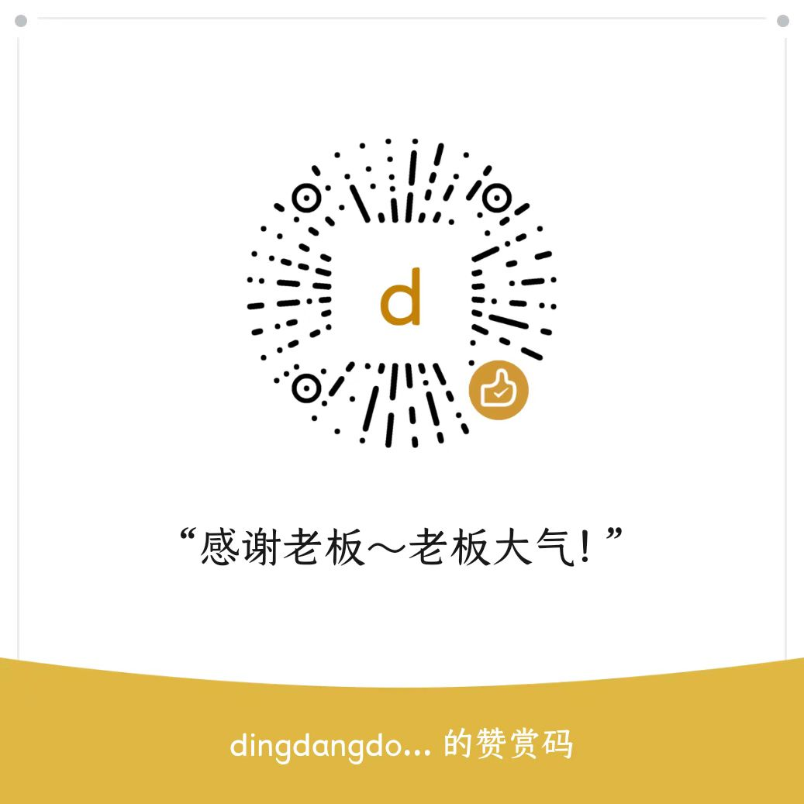

## Hello Friend 👋，I'm dingdangdog！

  

- 努力做一只帅气、有才、豁达的[老狗](https://oldmoon.top/)！
- Strive to be a handsome, talented, and magnanimous [old dog](https://oldmoon.top/)!

---

  

---

### 开源支持

非常高兴您能使用我开源的软件, 我是 [月上老狗/DingDangDog](https://oldmoon.top/), 一位开源独立开发者, 致力于提供高质量、免费的工具和资源。

| 支付宝                                                       | 微信                                                         | paypal                                                       |
| ------------------------------------------------------------ | ------------------------------------------------------------ | ------------------------------------------------------------ |
|  |  | 通过 PayPal 链接([dingdangdog](https://paypal.me/dddogx)) 捐赠 |

**感谢每一位支持我的人！**

**无论是通过捐赠，还是在项目中留下反馈或建议，您的参与都对我意义重大。**
<!--
**DingDangDog/DingDangDog** is a ✨ _special_ ✨ repository because its `README.md` (this file) appears on your GitHub profile.

Here are some ideas to get you started:

- 🔭 I’m currently working on ...
- 🌱 I’m currently learning ...
- 👯 I’m looking to collaborate on ...
- 🤔 I’m looking for help with ...
- 💬 Ask me about ...
- 📫 How to reach me: ...
- 😄 Pronouns: ...
- ⚡ Fun fact: ...
  -->
