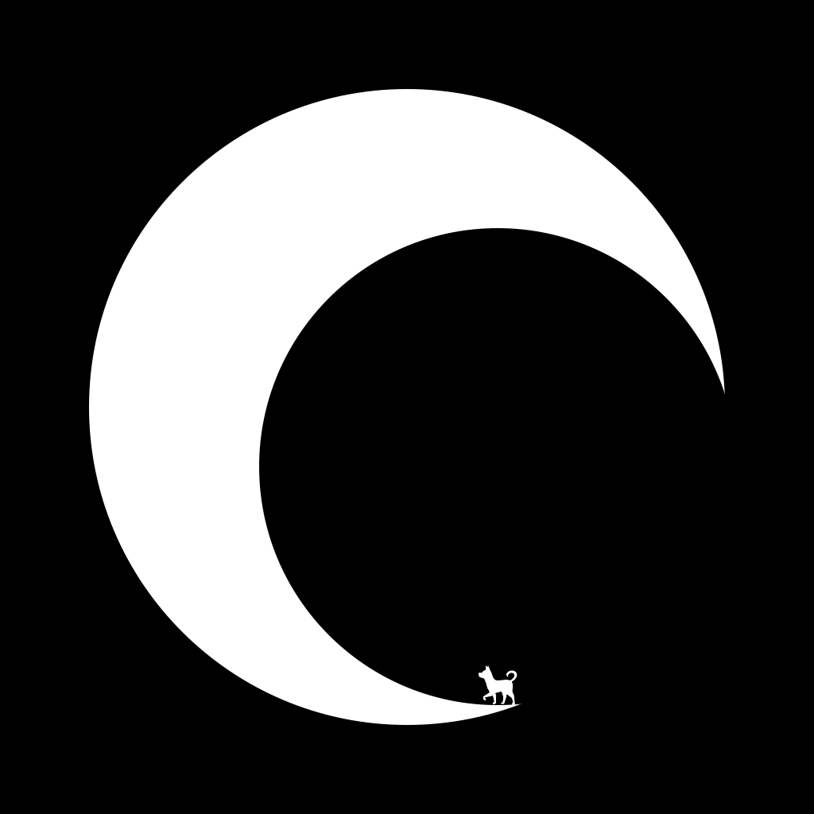

## Hello Friend 👋，I'm dingdangdog！

  

- 努力做一只帅气、有才、豁达的[老狗](https://oldmoon.top/)！
- Strive to be a handsome, talented, and magnanimous [old dog](https://oldmoon.top/)!

---

  

---

**感谢每一位使用我的项目的人！**

<!--
**DingDangDog/DingDangDog** is a ✨ _special_ ✨ repository because its `README.md` (this file) appears on your GitHub profile.

Here are some ideas to get you started:

- 🔭 I’m currently working on ...
- 🌱 I’m currently learning ...
- 👯 I’m looking to collaborate on ...
- 🤔 I’m looking for help with ...
- 💬 Ask me about ...
- 📫 How to reach me: ...
- 😄 Pronouns: ...
- ⚡ Fun fact: ...
  -->
